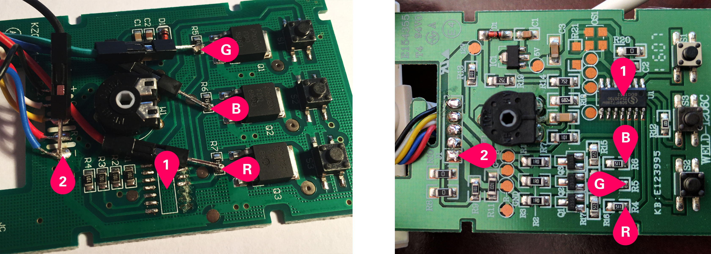

The internet of things and embedded programming as a whole has become a lot easier to pick up and get started with recently. This is mainly due to the advancements the Raspberry Pi foundation
has made with getting small and extendable computers in the hands of a lot of smart people, who in turn release some lovely libraries and frameworks the rest of us can use. One of these
excellent frameworks is [Nerves](https://www.nerves-project.org/) which makes running Elixir code on a Raspberry Pi really very easy and actually quite fun.

Although Elixir runs on top of the BEAM and is no-where near the fastest language out there, its actually (imho) very well suited to IoT development. Although the BEAM is quite a hefty runtime,
even my Raspberry Pi Zero has plenty of power to run several OTP applications at once while barely toeing 2-3% CPU usage. On top of this, you get lots of niceties that come with the Nerves project,
like remote firmware updates and an SSH shell over USB. Elixir and, by extension, the OTP, make it very easy to run multiple threads and applications at once, and communicate between them in a way
that won't keep you awake until 3 am.

Being able use OTP Supervisors in an IoT context is genuinely lovely. You write software in a different way as you only write the intended code paths with little to no error handling. If something
unexpected happens, I just let the thread crash and be restarted in a known good state. This is useful if, for example, I get an error code when trying to set a GPIO pin to a specific value, we just crash
and try again. This fixes it 99% of the time.

I've had some IKEA Dioder Lights laying around for a while, so decied they needed to become "smart" lights with a nice web interface and Alexa integration. With a bit of dissasembly and soldering,
this is actually very easy to do.

The finished product can be found on github here:
https://github.com/th0mas/Fancy-Lights 

### Setup

To get started, I had to butcher my old DIODER lights by removing the PCB from the controller case and prying off the chip already on there. Most people seem to use breadboards and MOSFETS to allow
the 5v Raspberry Pi GPIO headers to properly talk to the 12v DIODER LEDs, but the author of the [REDOID library](https://github.com/ffraenz/redoid) for Node.js seemed to figure out IKEA did the hard
work for us, and we can just solder some jumper wires onto the existing PCB, like so:

*Credit to ffranz for these helpful photos*

3 wires need to be connected from a Raspberry Pi to `R`, `G` and `B`. I recommend pins 4, 17, 18. These seem to work well. Additionally, a ground wire needs to be connected from a ground pin on the Pi
to `2`. The Chip `1` can be removed with a sharp knife.

### The code
The code for the actual firmware is very simple. I have a Nerves-Project based firmware as well as a Phoenix web-based GUI which I use to control the lights.

#### Nerves
The nerves code is essentially one `Genserver` that listens to a PubSub instance to control the lights using the `Pigpiox` library. `Pigpiox` communicates with `pigpiod`, a daemon that controls GPIO
pins on the Pi. I used this as it has a very efficient way of generating PWM waveforms which are needed for the lights.

All the code I wrote for the firmware is in one file (almost, I added one line elsewhere to add my light controller to the supervision tree.)

First, we define some constants such as the pins we're using and a default colour

```elixir
  @colour_component_pins [4, 17, 18] # [R, G, B]
  @default_colour "FFFFFF"

```

Then, a bit of boilerplate to start our genserver when our module is called by a supervisor;
```elixir
def start_link(opts) do
    GenServer.start_link(__MODULE__, opts, name: __MODULE__)
end
```

I then subscibed this Genserver to a Phoenix pubsub channel. This would easily allow me to communicate with the Genserver.
```elixir
  def init(_opts) do
    case Phoenix.PubSub.subscribe(FancyLights.PubSub, "lights:dioder") do
      :ok ->
        init_lights()
        {:ok, %{on: :true, colour: @default_colour}}
      {:error, term} ->
        {:stop, term}
    end
  end
```

We then need to handle messages passed to us via the PubSub system
```elixir
 def handle_info(%{event: "light_colour", payload: %{colour: colour}}, state) do
    change_colour(colour)
    {:noreply, %{ state | colour: colour}}
  end

  def handle_info(%{event: "light_off"}, state) do
    change_colour("000000")
    {:noreply, %{state | on: false}}
  end

  def handle_info(%{event: "light_on"}, state) do
    change_colour("FFFFFF")
    {:noreply, %{state | on: true}}
  end
```

As you can see, we call `change_colour/1` to change the colour, so lets define that:

```elixir
  def change_colour(hex) do
    hex
    |> String.trim_leading("#")
    |> get_colour_mapping
    |> apply_colour_mapping
  end
```
Finally some pipes ;) We take a hex value, turn it into a keyword list of `[{pin, value}]` and then apply this to the pins using `apply_colour_mapping/1`:

```elixir
  defp apply_colour_mapping(colours) do
    @colour_component_pins
    |> Enum.zip(colours)
    |> Enum.each(fn {pin, colour} ->
      Pwm.gpio_pwm(pin, colour)
    end)
  end
```

Thats it! and this runs in its own process, and automatically restarts in a good state if it ever crashes.

#### The UI
This is all useless without a UI to control the lights. I wrote a simple React frontend that communicated with a Phoenix socket running on the Pi. I won't go into details on this because someone else
probaly has a much better implementation than mine, and you should use theres.

But simply, on the frontend I have a hook that takes a light value and pushes it over a websocket:
```js
  useEffect(() => {

    socket.connect()
    let chan = socket.channel("lights:dioder")

    chan.join().receive("ok", (response) => {
      setLightState(response)
      setLightChan(chan)
    })

    chan.on("light_colour", (resp) => updateLight(resp))
    chan.on("light_on", (resp) => updateLight(resp))
    chan.on("light_off", () => updateLight({ on: false }))

    return () => {
      chan.leave()
    }
  }, [])

  const handleColourChange = (colour) => {
    setLightState({ ...lightState, ...{ colour: colour.hex } })
    lightChan.push("light_colour", { colour: colour.hex })
  }
```

We then deal with this on the backend using Phoenix's wonderful socket system:

```elixir
def handle_in("light_colour", %{"colour" => colour}, socket) do
    broadcast(socket, "light_colour", %{
      colour: colour
    })
    {:noreply, socket}
  end
```

Becuase we used Phoenix Pubsub in our firmware earlier, by updating all devices listening on this channel we kill three birds with one stone.
1. We confirm to the original client that the update worked and send the confirmed colour value
2. We update the state of any other connected clients in real time
3. We push a message to the light controller in the firmware to tell it to change the colour.

All we needed to do for this was to subscibe to the Pubsub server in the firmware, which we did by doing ` Phoenix.PubSub.subscribe(FancyLights.PubSub, "lights:dioder")`. Easy.

Patterns like being able to treat an on-device process the same as other clients make working with Elixir a satisfying experience, and you should try it too.


#### Thoughts

Elixir is a joy to do IoT programming in, and I hope its userbase grows in the coming year. Its not for everything but it covers 80% of usecases really well. When trying to connect with Alexa
I hit a small wall as I had to roll my own UPnP library rarther than just being able to use someone elses. The bluetooth story is not great either.

This was my first Elixir project so some of the code probaly isn't the most idiomatic, but I found it easy to quickly prototype effective code which is the most important thing for me. I'll 
continue to work on this project over summer and try and finalize a robust Alexa integration at some point.